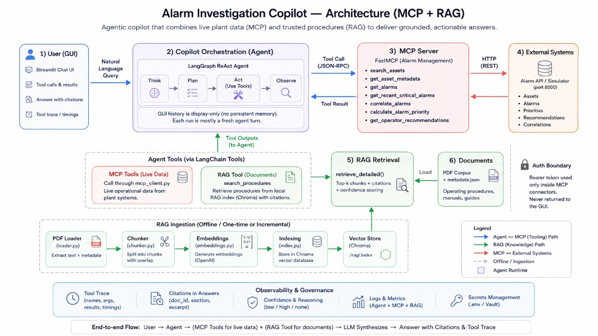

# Architecture

## Use case

Alarm Investigation and Procedure Guidance Copilot — evidence-backed investigation combining live Alarm Management API data (via MCP) with procedure/manual RAG.

## Diagram

The diagram shows both paths:

- **MCP path:** GUI → orchestration → MCP client → MCP server → Alarm API
- **RAG path:** orchestration → `search_procedures` → Chroma index / PDF corpus → citations

## Components

| Component | Location | Role |
|---|---|---|
| GUI | `apps/frontend` | Chat, alarm summary, citations, expandable MCP trace |
| Copilot orchestration | `apps/backend` | LangGraph ReAct agent; plans tool use; assembles answer |
| MCP client | `apps/backend/mcp_client.py` | Tool discovery + invocation (in-process FastMCP Client) |
| MCP server | `mcp-servers/alarm-management` | Typed tools over Alarm API |
| API connector | `connectors/alarm_api` | HTTP client: auth, retries, timeouts, error mapping |
| Alarm Management API | simulator container `:8000` | Source system |
| RAG ingestion | `rag/ingestion` | Load PDF → chunk → embed → Chroma |
| RAG retrieval | `rag/retrieval` | Filtered search, citations, grounded helper |
| Auth / config | `.env` | API token + OpenAI key; never returned in GUI answers |
| Observability | GUI tool trace | Tool name, args, response preview, success/error |

## Request flow

1. Operator enters a natural-language question in Streamlit.
2. Backend builds a LangGraph agent with MCP tools + `search_procedures`.
3. Agent discovers/uses tools as needed, typically:
   - `search_assets` → asset_id
   - `get_recent_critical_alarms` / `get_alarms`
   - optional `get_operator_recommendations` / priority / correlation
   - `search_procedures` for OP-/SI-/TG-/MM- guidance
4. Tool results stay in the agent message history as context.
5. Model writes a grounded answer citing document sections and summarizing alarms.
6. GUI renders answer, alarm rows, citations, and expandable MCP request/response previews.

## Boundaries

- Copilot orchestration **does not** call the Alarm API HTTP client directly.
- Only the MCP server (via `connectors/alarm_api`) talks to the Alarm API.
- RAG excerpts are treated as untrusted data (prompt-injection boundary).
- Secrets stay in environment / connector config; tool traces show payloads without bearer tokens.

## Persistence

- Chroma vector index on disk at `VECTOR_STORE_URL` (default `./rag/.index`).
- No conversational DB; each investigation is a fresh agent run (GUI chat history is display-only).
